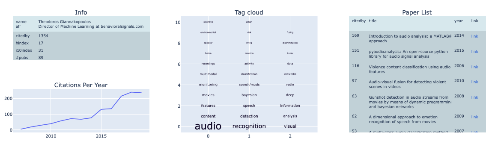

# pyScholar
## General
Python Library to Analyse and Visualise Google Scholar Metadata

## Execution Example
``python3 pyScholar.py -a "Theodoros Giannakopoulos" -o output.html -t 4 ``

Command line params are: (a) -a list of author names to be analyzed (b) -o output html path and (c) (optional) percentage threshold of minimum word frequency in author's word cloud.

Results can be seen in the following figure:

## Dependencies
To install dependencies use pip requirements file:

``pip install -r requirements.txt``
